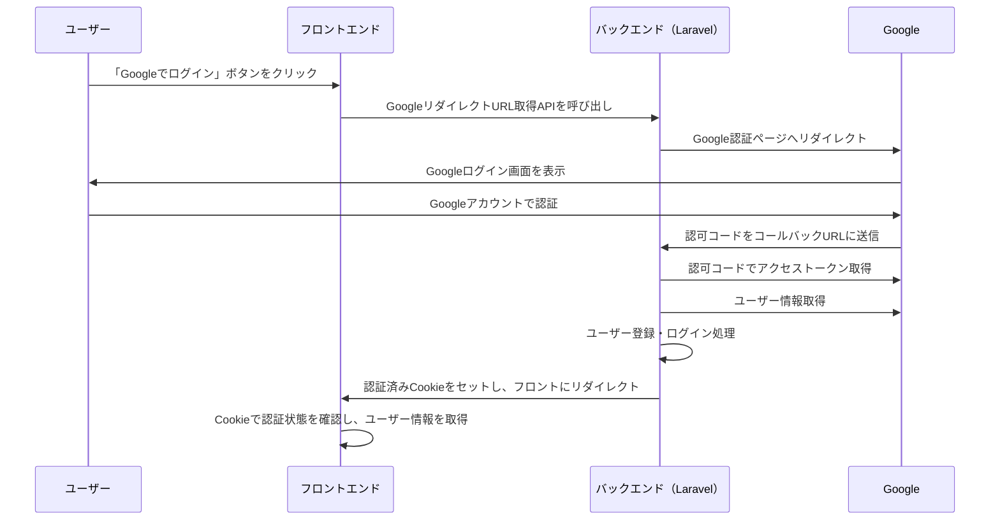

```mermaid
sequenceDiagram
participant User as ユーザー
participant FE as フロントエンド
participant BE as バックエンド（Laravel）
participant Google as Google

    User->>FE: 「Googleでログイン」ボタンをクリック
    FE->>BE: GoogleリダイレクトURL取得APIを呼び出し
    BE->>Google: Google認証ページへリダイレクト
    Google->>User: Googleログイン画面を表示
    User->>Google: Googleアカウントで認証
    Google->>BE: 認可コードをコールバックURLに送信
    BE->>Google: 認可コードでアクセストークン取得
    BE->>Google: ユーザー情報取得
    BE->>BE: ユーザー登録・ログイン処理
    BE->>FE: 認証済みCookieをセットし、フロントにリダイレクト
    FE->>FE: Cookieで認証状態を確認し、ユーザー情報を取得
```
